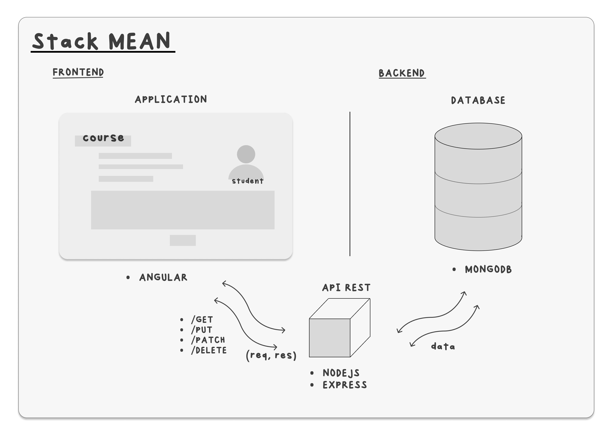

<h1 align="center">
  University Students Management
</h1>
<h4 align="center">Repository to manage the courses and students from the different universities.</h4>

<p align="center">


</p>
<br>

```bash

Angular CLI: 15.2.3
Node: 18.15.0
Package Manager: npm 9.5.0
OS: win32 x64

Angular:
...

Package                      Version
------------------------------------------------------
@angular-devkit/architect    0.1502.3 (cli-only)
@angular-devkit/core         15.2.3 (cli-only)
@angular-devkit/schematics   15.2.3 (cli-only)
@schematics/angular          15.2.3 (cli-only)
```

<br>

<div id="top"></div>

<!-- ## Table of Contents 📜

- [Setup](#setup)
- [Gist](#gist)
- [Wiki](#wiki)
  - [How to implement multilanguage support - Angular Application](#multilanguage)
  - [How to use ng-translate](#translate)
  - [How to implement PrimeNG breadcrumbs - Angular](#breadcrumbs)
  - [How to add Error interceptor - Angular](#interceptor)
  - [How to install Bootstrap - Angular](#bootstrap)
  - [How to create your own pipe - Angular](#pipe)
- [Mockups](#mockups)
- [Final Result and Deploy](#result)
  - [Mobile Version](#mobile)
  - [Desktop Version](#desktop)
  - [Responsive Version](#responsive)
- [Architecture](#architecture)
  - [SOLID](#solid)
  - [Scaffolding](#scaffolding)
- [Libraries](#libraries)
  - [pageNotFound](#pagenotfound)
  - [footer](#footer)
- [GitFlow](#gitflow)
- [SASS (SCSS)](#sass)
- [Author](#author)
- [License](#license) -->

<a name="setup"></a>

## Setup 🛠️

To clone and run this application, you'll need [Git](https://git-scm.com) and [Node.js](https://nodejs.org/en/download/) (which comes with [npm](http://npmjs.com)) installed on your computer. From your command line:

```bash
  # Clone this repository
  $ git clone https://github.com/Alanch8/university-students.git

  # Go into the repository
  $ cd university-students

  # Install dependencies
  $ npm install

  # Run the app
  $ npm run start
```

<!-- <a name="gist"></a>

<p align="right"><a href="#top">🔝</a></p>

## Gist 📝

<div  align="center" >
<a href="https://github.com/Alanch8/project-docu">
</img></a>
</div>
<br>

I have decided to use Github's Gist technology because in the private repositories it is not possible to use neither Wiki nor Github Pages (to display the README.md with embedded Gist).

I create an html page with these gists. I have taken advantage of this same repo which I have made public to create a wiki with tutorials of different problems and their solutions.

<b>My Gist:</b> https://alanch8.github.io/project-docu/my-gists.html

<a name="wiki"></a>

<p align="right"><a href="#top">🔝</a></p>

## Wiki 📖

<a name="multilanguage"></a>

#### How to implement multilanguage support - Angular Application

https://github.com/Alanch8/project-docu/wiki/How-to-implement-multilanguage-support---Angular-Application

<a name="translate"></a>

#### How to use ng-translate

https://github.com/Alanch8/project-docu/wiki/How-to-use-ng-translate

<a name="breadcrumbs"></a>

#### How to implement PrimeNG breadcrumbs - Angular

https://github.com/Alanch8/project-docu/wiki/How-to-implement-PrimeNG-breadcrumbs---Angular

<a name="interceptor"></a>

#### How to add Error interceptor - Angular

https://github.com/Alanch8/project-docu/wiki/How-to-add-Error-interceptor---Angular

<a name="bootstrap"></a>

#### How to install Bootstrap - Angular

https://github.com/Alanch8/project-docu/wiki/How-to-install-Bootstrap-in-Angular

<a name="pipe"></a>

#### How to create your own pipe - Angular

https://github.com/Alanch8/project-docu/wiki/How-to-create-your-own-pipe---Angular

<a name="mockups"></a>

<p align="right"><a href="#top">🔝</a></p> -->

## MEAN STACK 🎨

In this project I have used the MEAN stack, which is a collection of JavaScript based technologies used to develop web applications. MEAN is an acronym for MongoDB, Express.js, Angular and NodeJs.



<!-- 
<a name="result"></a>

<p align="right"><a href="#top">🔝</a></p>

## Result 🚀

<b>Link to <u>Vercel</u> Deploy:</b>

I thought it would be best to create a development environment and a production environment to be able to differentiate between them and always test in development before deploying to production.

You will only see console logs in development.

- [Development](https://star-wars-aitor-dev.vercel.app/)

<b><u>Easter Egg:</u></b> You will see confetti only on production. 🎉 🎉 🎉

- [Production](https://star-wars-aitor-prod.vercel.app/)

I design the project to be responsive and mobile first. I have used the <u>Bootstrap</u> framework to make it faster to implement the responsive design.

<a name="mobile"></a>

### Mobile version:

<div align="center">

</img>
</div>
<br>

<a name="desktop"></a>

### Desktop version:


<br>

<a name="responsive"></a>

### Online Responsive version:

URL: https://ui.dev/amiresponsive?url=https://star-wars-aitor-prod.vercel.app/


<a name="architecture"></a>

<p align="right"><a href="#top">🔝</a></p>

## Architecture 🏗️

To improve the scalability of the project, I thought of using a complete structure even though empty folders will not be uploaded to the GitHub repo.

<a name="solid"></a>

#### SOLID

I tried to use as much as posible the SOLID Principles in this project. I have tried to separate the logic of the components as much as possible and create services and a model (interface) to be able to reuse them. I have also tried to use the **DRY** and **KISS** principles as much as possible. With more time, much more iteration could be done. ⏳

<a name="scaffolding"></a>

This is the initial scaffolding of the project to improve the scalability as I said before. The final repo is a little bit different because Github don't track empty folders.

#### Scaffolding

<div align="center">

</img>
</div>

<a name="libraries"></a>

<p align="right"><a href="#top">🔝</a></p>

## Libraries 📚

My NPM Libraries:

- [Link to my npm profile](https://www.npmjs.com/settings/alanch8/packages)

<a name="header"></a>

#### Page Not Found (404)

I decided to create a 404 page to be able to redirect the user to the home page if he tries to access a page that does not exist.

I thought it would be a good idea to create a library to be able to reuse it in other projects.

You can find the library here: https://www.npmjs.com/package/alanch8-page-not-found

<a name="footer"></a>

#### Footer

With the footer component I thought it would be a good idea too. In this case, I have created a footer with my personal brand logo that redirects you to my personal website, my Linkedin, Github and Twitter profiles. 

Furthermore I have added a link to a mailto: with my email address inside my name on the Copyright section.

You can find the library here: https://www.npmjs.com/package/alanch8-footer

<a name="gitflow"></a>

<p align="right"><a href="#top">🔝</a></p>

## Gitflow 📦

In this project I have decided to apply something similar to Gitflow, so I have practiced a lot all the possible conflicts that can happen working with it.

I have created a develop branch and a production (main) branch. I have also created a feature branch for each feature that I have implemented.

I have also created a <u>release branch</u> to be able to test the application before deploying it to production. I add a release tag (v1.0.0) to the commit that I want to deploy to production.

Finally, I deleted the feature branches that I had created.

I also created a project with <u>Kanban</u> board and used issues to be able to track the progress of the project.

<a name="sass"></a>

<p align="right"><a href="#top">🔝</a></p>

## SASS 💄

### Animations

I used scss animations for the cards and the information inside the cards.

I also used Animate.css librarie to make a fadeIn animation when the page is loaded and show how to do it. (I as easy as adding the class "animate__animated animate__fadeIn" to the element that you want to animate.)

```css
.card {
  margin: 5px 5px;
  border-radius: 10px;
  width: 320px;
  height: 200px;
  background-repeat: no-repeat;
  background-size: cover;
  cursor: pointer;
  overflow: hidden;
  border: none;
}

.card:hover {
  box-shadow: 0px 4px 8px rgba(0, 0, 0, 0.5);
  transform: scale(1.05);
  transition: all 0.5s ease;
}
```

### Mixins

I have tried to make mixins to take advantage of code but finally I have not been able to square them.

```css
@import url("https://fonts.googleapis.com/css2?family=Nunito+Sans:wght@300;800&display=swap");

$primary: #fdfdfd;
$secondary: #1a1a1a;
$tertiary: #ffcc00;
$gray-light: #c4c4c4;

$font-family-titles: "Nunito Sans", sans-serif;
$font-family-text: "Nunito Sans", sans-serif;
$font-family-details: "Nunito Sans", sans-serif;
``` -->

### Time spent

| Day      | Time (h) |
| -------- | -------- |
| Friday   | 0h       |
| Saturday | 2h       |
| Sunday   | 10h      |
| Total    | 12h      |

<a name="author"></a>

## Author 🧑‍💻

🧑‍💻 Aitor Lancharro Hurtado <br>
📥 aitor.lancharro@gmail.com <br>
🌐 <a href="https://www.aitorlancharro.com">www.aitorlancharro.com</a><br>

<a name="license"></a>

## License 📄

[MIT](https://choosealicense.com/licenses/mit/)

---

Thanks for reading! 🙌

<p align="right"><a href="#top">🔝</a></p>

<p align="center">Aitor Lancharro "Alanch8" ☕</p>
